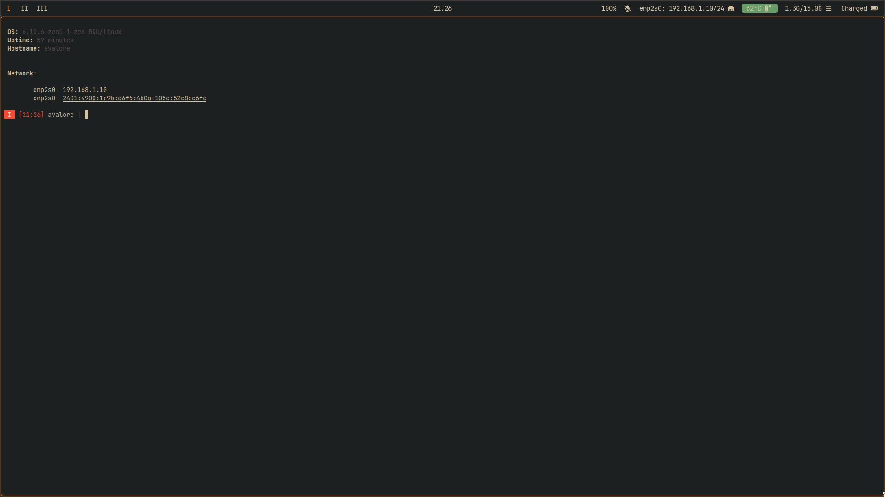

# Personal Dotfiles

This repository serves as a Git mirror for my personal dotfiles. Please note that this repository is a work in progress and may contain configurations that are not suitable for general use.

> **Warning:**  
> If you decide to use this repository, make sure to **update the Hyprland monitor configuration**. I have disabled my primary monitor (the laptop screen), so you'll need to adjust that setting for your own setup.

## Notable Scripts

### fzf_tmux

A global tmux sessionizer that provides fuzzy search capabilities over selected directories, allowing you to create tmux sessions quickly.

- Location: `avalore/.local/bin/fzf_tmux`
- Caches directory list for faster startup times
- Default cache: `$HOME/.dir_cache`
- Usage:
    - Run `fzf_tmux`
    - Force cache update: `fzf_tmux --update`

### tofi_bookmarks

Integration of [tofi](https://github.com/philj56/tofi) for bookmark management.
  
- Location: `avalore/.local/bin/tofi_bookmarks`
- Global storage of links, or anything text.
- Default store: `$HOME/.bookmarks`
- Usage:
    - Run `tofi_bookmarks`.

## Screenshots

### Dark Mode

## License

Just yoink it.
