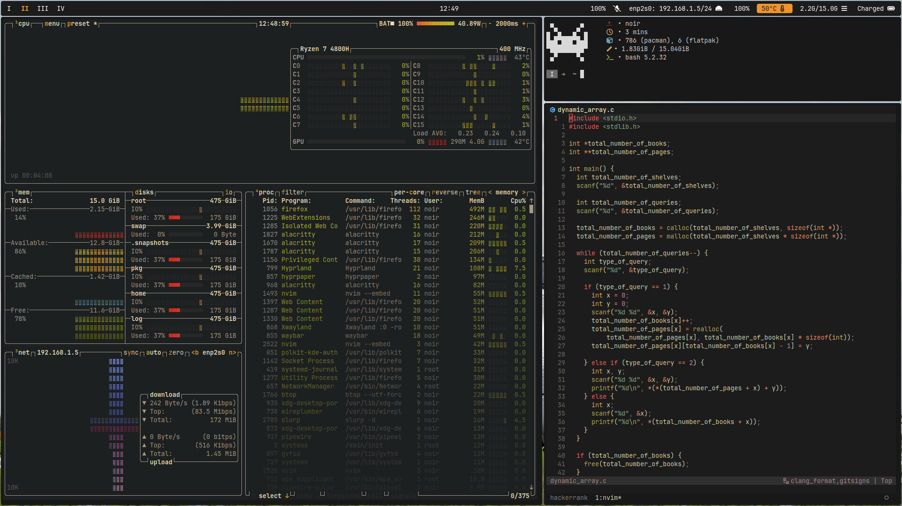

# Personal Dotfiles

This repository serves as a .git mirror for my personal dotfiles.
This entire repository is a giant mess, don't use it.

The `install.sh` script is meant for PopOS! and Ubuntu only.
It is a backup incase Arch Linux goes boom!

## Screenshots

