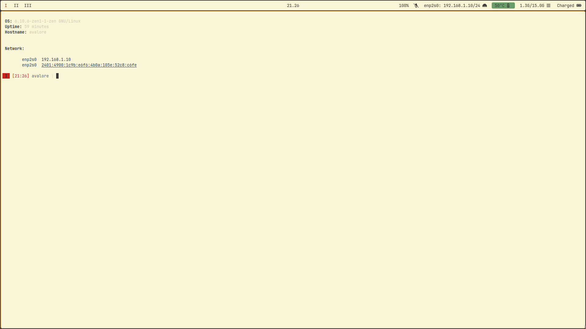

# Personal Dotfiles

This repository serves as a .git mirror for my personal dotfiles.
This entire repository is a giant mess, don't use it.

The `install.sh` script is meant for PopOS! and Ubuntu only.
It is a backup incase Arch Linux goes boom!

> [!WARNING]
> If, you do decide to use this **make** sure to change the hyprland monitor config.
> I disable my primary monitor (laptop screen), change that setting.

## Screenshots

### Dark mode

### Light mode

